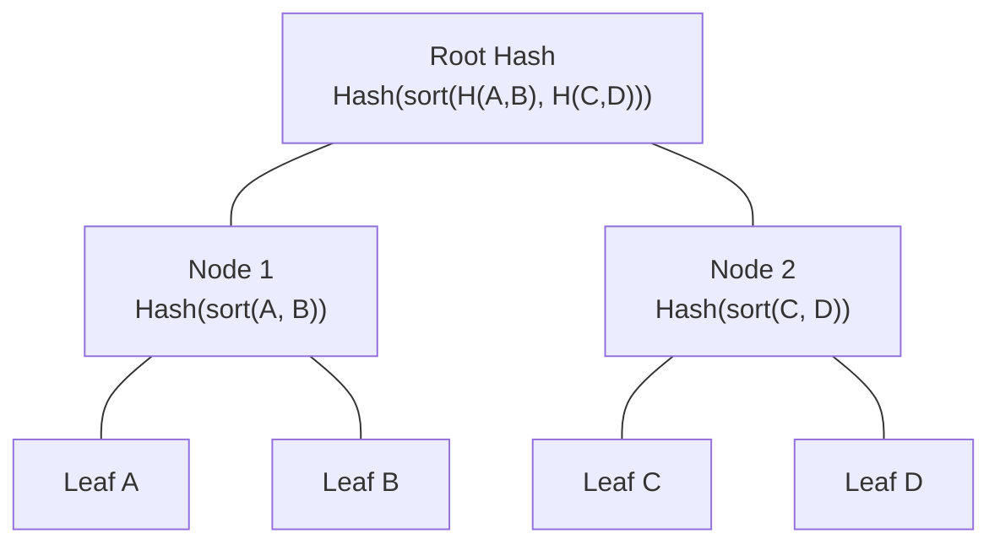

# ADR 001: Sorted-Pair Merkle Tree for Receipt Verification

## Context
When verifying that a given receipt belongs to an anchored batch, we need a cryptographic proof. A standard Merkle tree proof requires not only the sibling hashes but also the positional index (left or right) for each step in the path to ensure the hashes are concatenated in the correct order.

## Decision
We chose a **sorted-pair Merkle tree** convention. When hashing two child nodes to compute their parent's hash, the two child hashes are first sorted lexicographically (e.g., as byte arrays) before being concatenated and hashed.

## Consequences

### Benefits
1. **Reduced Proof Size:** The proof only needs to be an array of sibling hashes. We don't need to encode or transmit the left/right directional bits.
2. **Lower Gas Costs:** On Soroban, parsing smaller proof structures and simplifying the verification loop (just sorting two 32-byte arrays instead of conditional branching on a bitmask) saves CPU instructions and memory allocation, leading to lower execution fees.
3. **Simpler Verification Logic:** The on-chain loop simply takes the current hash and the next proof element, sorts them, and hashes them together.

### Trade-offs
- **Loss of Positional Data:** We can prove a receipt is in the batch, but we cannot prove *where* it is in the batch (its exact index). For our use case (receipt inclusion verification), this index is irrelevant, making the trade-off highly favorable.

## See also

The sorted-pair convention above is exactly what the shared conformance vectors
exercise. How those vectors are kept identical between the Rust contract and the
TypeScript SDK — and what that parity does and does not prove — is documented in
[`docs/CONFORMANCE.md`](CONFORMANCE.md) (issue #53).
