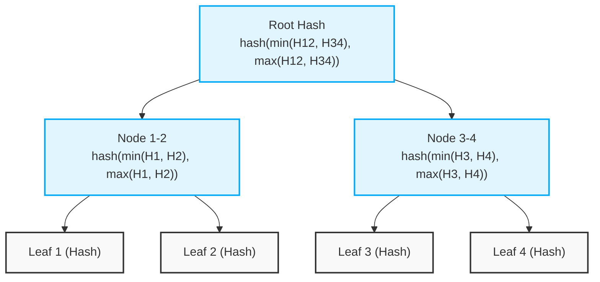

# ADR 001: Sorted-Pair Merkle Tree Structure

**Status:** Accepted
**Context:** `ReceiptAnchor` and off-chain SDK

## Problem

In a standard Merkle tree, validating a proof requires knowing whether each sibling hash in the proof path is a left child or a right child, so they can be concatenated in the correct order before hashing. This typically requires passing positional metadata (e.g., an array of booleans or a bitmap) alongside the hashes in the proof. 

Passing this metadata on-chain to Soroban smart contracts increases calldata size, parsing complexity, and WASM instruction counts, which in turn increases transaction fees.

## Decision

We use a **sorted-pair SHA-256** strategy for Merkle tree construction and verification. 
When computing the parent hash of two siblings `a` and `b`, we sort them lexicographically before hashing:

```rust
if a < b {
    hash(a, b)
} else {
    hash(b, a)
}
```

This sorted-pair convention is used both in the off-chain TypeScript SDK (to build the tree and generate proofs) and in the on-chain `ReceiptAnchor` contract (to verify proofs).

## Mechanics and Visuals

By sorting the siblings before concatenation, the order of hashes is deterministic based purely on their values. The verification logic does not need to know whether a proof node is a left or right sibling in the original tree structure. It simply takes the current working hash and the next proof hash, sorts them, and hashes the result. This completely eliminates the need for positional flags in the proof array.

### 4-Leaf Tree Example



## Trade-offs

### Benefits
- **Lower WASM Instruction Counts:** The on-chain verification loop is simpler. It doesn't need to parse metadata or branch on positional flags beyond the simple lexicographical comparison.
- **Smaller On-Chain Calldata Footprint:** The proof is merely an array of 32-byte hashes (`Vec<BytesN<32>>`). No extra booleans or bitmasks are passed, keeping the payload compact.
- **Cheaper Fees:** Reduced calldata size and fewer WASM instructions directly translate to lower execution and rent fees on Soroban.

### Drawbacks
- **Non-Standard Tooling Compatibility:** Standard Merkle tree libraries (like OpenZeppelin's MerkleProof in Solidity or generic JS libraries) do not support sorted-pair hashing out of the box. Both our off-chain SDK and on-chain contracts must use our custom implementation, and third-party integrators cannot use off-the-shelf standard Merkle proof generators without modification.

## Security Context

The primary security concern with sorted-pair Merkle trees is the potential for **second-preimage attacks**, where an attacker might forge a proof by reordering nodes or treating inner nodes as leaves. 

However, this design choice remains safe against collision and second-preimage attacks due to our specific constraints:
1. **Uniform 32-Byte Leaves:** All leaves in our tree are strictly 32-byte hashes (the `payment_ref`). Because the leaves and the inner nodes both have the exact same fixed length (32 bytes), an attacker cannot exploit variable-length concatenation vulnerabilities.
2. **Domain Separation (Contextual):** While we do not use explicit domain separation byte prefixes (e.g., `0x00` for leaves, `0x01` for inner nodes) in this specific optimization, the uniform strictness of 32-byte elements ensures that an inner node (which is a hash of two 32-byte hashes) cannot be easily confused for a valid leaf (which is a hash of a receipt) in a way that allows a targeted second-preimage collision. The attacker would have to find a receipt whose hash exactly equals the hash of two other nodes, which reduces to breaking the collision resistance of SHA-256.

Therefore, for our specific 32-byte leaf constraints, sorting before hashing does not compromise collision resistance.
