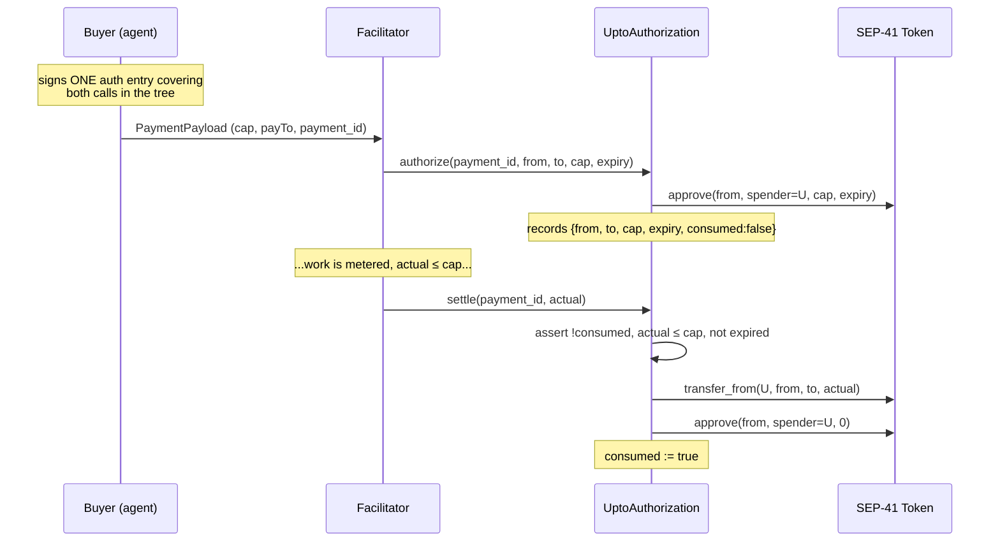

# ADR 002: The `upto` Settlement Scheme on Stellar

> **Status: DRAFT — §6.1 resolved; remaining open questions pending.**
> §6.1 answers the upstream-specification research question (issue #61). The remaining
> open questions (§6.2–6.6) require Soroban-specific implementation work, not upstream
> research. The design in §4 is **not excluded** by the upstream `upto` spec. Do not cite
> this document as a design that works; cite it as the design being investigated.

## 1. Context

x402 settles today on Stellar with the `exact` scheme: the buyer signs an authorization
committing to a specific amount, and the facilitator submits it. `exact` is specified for
Stellar in `scheme_exact_stellar.md`.

`upto` is the scheme for **metered** services — token billing, per-inference charges,
anything where the price is not known when the request is made. The buyer authorizes a
cap; the seller meters actual usage; the facilitator settles the actual amount, which is
at most the cap. It has EVM and SVM implementation specs. **It has no Stellar one.**

That gap is the reason this ADR exists. Authoring `scheme_upto_stellar.md` and
contributing it upstream is a deliverable of the SCF x402 Facilitator RFP, and it is the
part of that RFP where this repo's existing work — Soroban contracts with a real TTL,
rent, and eviction strategy — is directly relevant rather than adjacent.

## 2. The core problem: Soroban auth commits to every argument

This is what makes `upto` structurally harder on Stellar than a naive reading suggests.

Soroban authorization is not a pre-signed transaction. The buyer signs an **auth entry**
permitting a *specific contract invocation* — and that signature commits to the full
argument list of the call being authorized. There is no mechanism for signing an
invocation with one argument left free to be filled in later.

So the obvious construction does not exist:

```
buyer signs:  token.transfer(from, to, ???)   ← `actual` is unknown at signing time
```

The buyer signs before the work is metered. The amount is known only after. Any `upto`
design on Stellar must therefore split authorization from settlement across two
invocations, and carry the binding between them in on-chain state.

## 3. Why SEP-41 allowances alone are insufficient

The RFP asserts this and it should be understood rather than repeated. SEP-41 offers
`approve(from, spender, amount, expiration_ledger)` followed by
`transfer_from(spender, from, to, amount)`. Using that pair on its own fails the scheme's
two guarantees:

| Guarantee | Why `approve`/`transfer_from` does not provide it |
|---|---|
| **Recipient binding** | An allowance authorises a *spender*, not a *destination*. A facilitator holding an allowance can `transfer_from` to any address it likes. Nothing ties the movement to the `payTo` the buyer agreed to. |
| **Single settlement** | An allowance is a standing balance that can be drawn repeatedly until exhausted or expired. Two partial draws totalling the cap are indistinguishable, at the token layer, from one correct settlement. |

There is a third, practical objection: `approve` is a separate transaction the buyer must
submit, which means the buyer needs XLM for fees or a separate sponsorship path — against
an RFP requirement that the buyer need only hold the payment asset.

**A contract-free design is therefore possible but strictly weaker, and the RFP requires
that its weaker trust model be documented explicitly rather than glossed.** This ADR
proposes a contract.

## 4. Proposed construction: a thin authorization-binding contract

The contract holds no funds. It exists to bind a recipient and to make settlement
single-shot — the two properties the allowance primitive cannot express.



The pieces that carry the guarantees:

- **Recipient binding** — `to` is recorded at authorization time from the buyer's signed
  auth entry and is *not* an argument to `settle`. The facilitator cannot redirect the
  payment, because it never supplies the destination.
- **Single settlement** — the `consumed` flag is set in the same invocation that moves
  the funds. A second `settle` on the same `payment_id` fails.
- **No residual allowance** — settlement clears the approval to zero in the same call, so
  `cap - actual` does not linger as a standing claim on the buyer's balance.
- **No custody** — the contract is a spender, never a holder. Funds move directly from
  buyer to seller. This preserves the RFP's non-custodial requirement, which a
  cap-into-escrow design would complicate.

### Expiration

Two independent clocks, and conflating them is a likely bug:

1. **`signatureExpirationLedger`** on the auth entry, bounded by `maxTimeoutSeconds` —
   roughly 12 ledgers, about 60 seconds by default. This bounds how long the *signed
   authorization* is submittable, and is far too short to bound a metered session.
2. **The authorization record's own `expiry`**, stored on-chain. This bounds how long
   after `authorize` a `settle` may occur, and must be long enough for the metered work
   to complete. If it lapses, the correct behaviour is that `settle` fails and the
   allowance is reclaimable by the buyer.

### Storage, TTL, and rent

Each open authorization is a persistent entry, so it carries rent and can be evicted —
the failure mode this repo already handles for `ReceiptAnchor` batches and `RefundVault`
refunds. Applying the same approach:

- Authorization entries are **temporary storage keyed to their own expiry**, not
  persistent storage, since an authorization has no meaning after it lapses. This is a
  deliberate difference from `RefundVault`, where a refund record must outlive the
  refund window for auditability.
- A `prune` path for lapsed authorizations, mirroring `prune_batches`.
- **Who pays the rent must be stated.** The natural answer is the facilitator, since it
  is the party that benefits from the authorization existing, but this needs costing —
  the RFP is explicit that per-payment on-chain overhead must stay off the hot path.

## 5. Consequences

### Benefits
- Provides both guarantees the RFP names, rather than documenting their absence.
- Non-custodial: no escrow, no pooled balance, no operator holding buyer funds.
- Composes with Stellar smart-account spending policies — a `__check_auth` account can
  apply a budget policy to the `authorize` call, keeping an agent inside a spend limit
  without the facilitator needing to enforce it.

### Costs — state these plainly
- **Two on-chain invocations per metered payment instead of one.** For an RFP whose
  premise is that sub-cent fees make per-request payment viable, roughly doubling
  settlement cost is a real objection and must be priced, not waved past.
- **It ships a Soroban contract**, which expands the security review from "an off-chain
  service and its cryptographic validation" to a contract audit. The RFP's costing note
  assumes v1 ships no new contract; proposing this changes that line item.
- Adds a second expiry concept that integrators can get wrong.

### The alternative, kept open
A contract-free variant — plain `approve`/`transfer_from` with the facilitator trusted
not to redirect or split the draw — is cheaper, ships no contract, and keeps the audit
scope small. It is a legitimate v1 if and only if the weaker trust model is documented
explicitly, as the RFP demands. **The decision between these two is not made in this
ADR.**

## 6. Open questions — resolve before proposing this upstream

### 6.1 ✅ Does the upstream `upto` spec permit a two-invocation construction?

**Answer: Yes — the two-invocation construction is VIABLE.**

Researched against `x402-foundation/x402` at commit
`b32b5640557ff793c3ecbfac6f933b0ad3b2170b` (2026-08-26). See
[`docs/upto-upstream-notes.md`](upto-upstream-notes.md) for the full research
notes, direct quotations, and per-question analysis.

**The upstream specification does NOT require exactly one settlement call.** The core
spec explicitly permits multiple settles:

> "`/settle` MAY be invoked more than once for a single payment (for example, the
> `escrow` flow settles a deposit before the resource executes and the final charge
> after). A scheme defining multiple settles MUST specify how the facilitator
> distinguishes them from payload content." — x402-specification-v2.md §7.2

**The SVM `upto` spec uses two settle calls** (the `escrow` payment flow):

> "Settlement happens after the resource server executes the metered work and before
> it returns the response to the client. The overall order is
> `settle(deposit)` → resource execution → `settle(claim)` → serve." —
> scheme_upto_svm.md §5

**The five normative `upto` properties** (from scheme_upto.md) are:

1. Single-use authorization — "Each authorization MUST be settled at most once."
2. Time-bound authorization — MUST have `validAfter` and `deadline`.
3. Recipient binding — MUST cryptographically bind the recipient address.
4. Maximum amount enforcement — settled amount MUST be `<=` authorized maximum.
5. Phase-dependent `amount` semantics — `PaymentRequirements.amount` is max at
   verify, actual at settle.

The Stellar two-invocation construction (§4: `authorize` → `settle`) maps directly to
the `escrow` flow:

| Escrow step | Stellar equivalent |
|---|---|
| First `settle(deposit)` | `authorize()` — commits ceiling, recipient, creates binding |
| Resource execution | Metering |
| Second `settle(claim)` | `settle(actual)` — transfers actual amount, sets consumed |

**The upstream spec architecture explicitly supports network-specific constructions.**
Both EVM and SVM use fundamentally different mechanisms (Permit2 vs. payment channels)
that both satisfy the same five properties. The `extra` field, per-network scheme
documents, and scheme templates all indicate the architecture expects variation.

**Critical distinction — what is normative vs. implementation detail:**

| Category | What it covers | Example |
|---|---|---|
| **Normative MUST** (protocol-level) | The five core `upto` properties | Single-use, time-bound, recipient binding, max enforcement, phase-dependent amount |
| **Implementation-specific** | How a network realizes those properties | Permit2 on EVM, payment channels on SVM, authorization-binding contract on Stellar |
| **Unstated** | Behavior the spec is silent on | Exact number of `/settle` calls, transaction structure, on-chain state model |

**Remaining Stellar-specific design work required:**

The two-invocation construction is not excluded, but is not automatically valid either.
The following Stellar-specific work is still needed:

1. **Auth entry expiration.** Soroban `signatureExpirationLedger` is short (~12
   ledgers, ~60s). If `authorize` and `settle` are in separate transactions, the auth
   entry must survive until settlement. If both are in one transaction (as §4
   proposes), this is not a problem.
2. **Protocol flow declaration.** The Stellar `upto` spec should declare
   `extra.paymentFlow: "escrow"` to match the SVM precedent.
3. **Deposit vs. claim distinction.** The facilitator must distinguish the two settle
   calls. On SVM this is done from payload content (voucher present → claim; no voucher
   → deposit). Stellar needs an equivalent.
4. **State lifecycle.** Authorization record TTL, cleanup, and rent payment must be
   designed.
5. **Cost analysis.** Two Soroban invocations per metered payment must be priced
   against the RFP's per-transaction overhead constraints.

### 6.2 Can one signed auth entry cover both invocations?

**Open.** The construction in §4 assumes the buyer signs a single auth tree with
`approve` as a sub-invocation. This needs confirming against Soroban's authorization
semantics — if it requires two separate buyer signatures, the UX weakens considerably.
This is a Soroban-specific question, not an upstream-spec question.

### 6.3 What does `settle` cost?

**Open.** Does the pair stay within per-transaction CPU, memory, read, and write
limits under realistic load? Requires implementation and benchmarking.

### 6.4 Sequence-number contention

**Open.** Agent traffic is bursty and the facilitator submits every settlement.
Channel accounts are the standard answer; that needs designing, not naming.

### 6.5 Refund interaction

**Open.** `RefundVault` keys refunds on a payment reference. If an `upto` payment
settles for less than its cap, what is the refundable amount — and does anything need
to change here?

### 6.6 Does the facilitator need `authorize` at all?

**Open.** Fee sponsorship (`extra.areFeesSponsored`) suggests the facilitator submits,
but the buyer calling `authorize` directly may be viable. Should follow from the
spec design rather than convenience.

## References
- `rfp.md` §3.4 (settlement schemes), §3.5 (Stellar-specific considerations), §3.6
  (audit scope)
- `docs/ADR-001-merkle-structure.md` — prior ADR format
- `docs/SECURITY_MODEL.md`, `docs/storage-audit.md` — existing TTL and storage analysis
- Upstream: `x402-foundation/x402` @ `b32b5640557ff793c3ecbfac6f933b0ad3b2170b`
  - `specs/schemes/upto/scheme_upto.md` — chain-agnostic upto spec
  - `specs/schemes/upto/scheme_upto_evm.md` — EVM upto implementation spec
  - `specs/schemes/upto/scheme_upto_svm.md` — SVM/Solana upto implementation spec
  - `specs/x402-specification-v2.md` — core x402 v2 protocol
- [`docs/upto-upstream-notes.md`](upto-upstream-notes.md) — full research notes for §6.1
